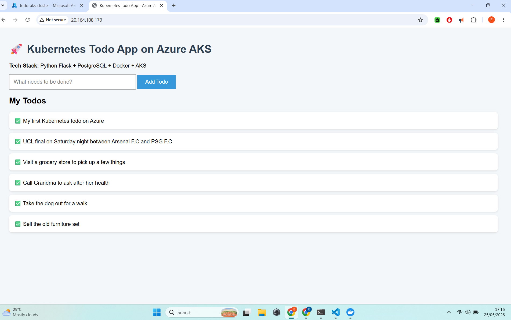

# 🚀 Flask Todo App on Azure Kubernetes Service (AKS)

A full-stack **Todo Application** successfully deployed on **Azure Kubernetes Service (AKS)**.

## ✨ Live Application
**URL:** http://20.164.108.179



## 🛠️ Tech Stack

- **Backend**: Python + Flask
- **Database**: PostgreSQL
- **Containerization**: Docker
- **Orchestration**: Kubernetes (AKS)
- **Cloud**: Microsoft Azure

## 📸 Screenshots

  
*Clean and functional Todo List Interface*

  
*Pods, Deployments and Services running on AKS*

  
*Azure Kubernetes Service Cluster Overview*

## 📁 Project Structure

```bash
flask-todo-aks/
├── app/
│   ├── app.py
│   ├── requirements.txt
│   └── Dockerfile
├── k8s/
│   ├── namespace.yaml
│   ├── postgres-deployment.yaml
│   ├── postgres-service.yaml
│   ├── flask-deployment.yaml
│   └── flask-service.yaml
└── README.md


 Key Concepts Demonstrated

Multi-tier architecture (Backend + Database)
Docker containerization
Kubernetes Deployments & Services (LoadBalancer)
Environment variables and configuration
Deploying real applications on Azure cloud


What I Learned

How to deploy stateful applications (PostgreSQL) on Kubernetes
Connecting services using DNS names
Troubleshooting common issues (CrashLoopBackOff, image pulling, etc.)
Managing cloud resources on Azure AKS


